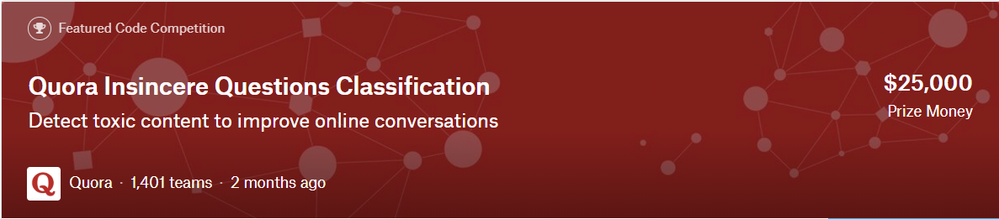

# Quora-Insincere-Questions-Classification
Detect toxic content to improve online conversations


[link to kaggle](https://www.kaggle.com/c/quora-insincere-questions-classification)

[link to kaggle notebook](https://www.kaggle.com/bharatb964/qura-comp/edit/run/9177767)

[link to google colab](https://colab.research.google.com/drive/1xxyIqipnvbSRzNhTsLponlCHMXk40Qlt)


The problem is to predict whether a question asked on Quora is sincere or not. the training data includes the question that was asked and whether it was identified as insincere (target=1). The are 4 word embeddings are provided with the dataset that we'll be using in our models ([link to dataset](https://www.kaggle.com/c/quora-insincere-questions-classification/data)). 
#### Word embeddings:
```
* GoogleNews-vectors-negative300 - https://code.google.com/archive/p/word2vec/
* glove.840B.300d - https://nlp.stanford.edu/projects/glove/
* paragram_300_sl999 - https://cogcomp.org/page/resource_view/106
* wiki-news-300d-1M - https://fasttext.cc/docs/en/english-vectors.html
```
#### Tokenization:
since the data contains the sentences, we'll tokenize the sentences into words. For tokenization we'll use keras Tokenizer library ([Tokenizer](https://keras.io/preprocessing/text/)). This class will allow us to vectorize a text corpus, by turning each text into a vector where the coefficient for each token is binary (0 and 1). we'll keep the most common 10000 words in the sentences for tokenization.
```python
from keras.preprocessing.text import Tokenizer
tokenizer=Tokenizer(num_words=10000)
```
#### LSTM model
